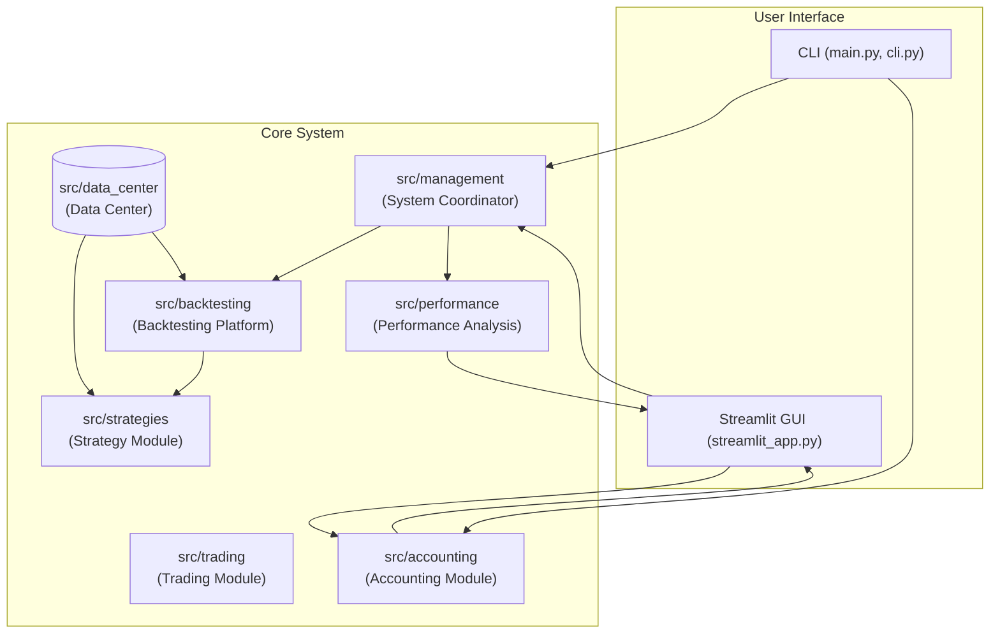

### Quant Investment System Architecture

The system is designed with a modular architecture, separating concerns to enhance maintainability and scalability. Each module corresponds to a specific directory within the `src/` folder.



- **`src/management` (System Coordinator)**: Oversees the entire system, coordinating all other modules via the `SystemCoordinator` class. It orchestrates backtests, manages configurations, and provides a central point for system health checks.
- **`src/strategies` (Strategy Module)**: A repository of investment strategies, inheriting from `BaseStrategy`. It includes static-weight portfolios (`classic.py`) and dynamic strategies that adjust to market conditions (`dynamic_strategies.py`).
- **`src/trading` (Trading Module)**: Executes trades as instructed by the strategy modules. It features a `TradeExecutor` for simulated, paper, and live trading, handling `Order` objects and simulating costs.
- **`src/backtesting` (Backtesting Platform)**: Implemented using the `backtrader` library within the `EnhancedBacktestEngine`. It allows strategies to be tested on historical data, modeling execution lag, commissions, and slippage to simulate performance realistically.
- **`src/performance` (Performance Analysis)**: The `PerformanceAnalyzer` evaluates strategy effectiveness, calculating key metrics (Sharpe ratio, max drawdown) and generating reports and charts with `matplotlib`.
- **`src/data_center` (Data Center)**: Manages all system data. `download.py` fetches raw market data using `akshare` and `yfinance`. `data_loader.py` provides clean, date-indexed DataFrames to other modules. `data_processor.py` generates derived datasets for strategies.
- **`src/accounting` (Accounting Module)**: Professional accounting system with dual-currency support. Processes monthly transactions, assets, and exchange rates to generate balance sheets, income statements, and cash flow statements. Features simplified data models for streamlined monthly workflow and comprehensive validation.

#### Implementation Samples (by module)

- **Data Center (Download with `akshare`)**: Data is downloaded via scripts and stored locally. The system uses `akshare` for Chinese market data.

```python
# From: src/data_center/download.py
import akshare as ak

def download_akshare_index(symbol, asset_name):
    """Download index data from akshare"""
    try:
        LOG.info(f"Downloading {asset_name} data from akshare (symbol: {symbol})")
        data = ak.stock_zh_a_hist(symbol=symbol, period="daily", adjust="qfq")
        # ... (merging and saving logic) ...
    except Exception as e:
        LOG.error(f"Error downloading {asset_name} from akshare: {e}")
```

- **Data Center (Load for `backtrader`)**: The backtesting engine loads this local data into a format compatible with `backtrader`.

```python
# From: src/data_center/data_loader.py
class DataLoader:
    def load_data_feed(self, asset_name: str, name: str, start_date: Optional[str] = None) -> Optional[bt.feeds.PandasData]:
        """Load data feed from CSV file with enhanced validation"""
        # ... (finds file, reads CSV) ...
        df = self._validate_dataframe(df, asset_name)
        # ... (creates OHLCV columns) ...
        data_feed = PandasData(dataname=df)
        return data_feed
```

- **Strategy Module (Dynamic Allocation)**: Strategies calculate target weights based on processed data, such as P/E ratios or economic indicators.

```python
# From: src/strategies/builtin/dynamic_strategies.py
class DynamicAllocationStrategy(DynamicStrategy):
    def calculate_target_weights(self, current_date) -> Dict[str, float]:
        """Calculate target weights based on P/E percentiles and yield data"""
        # ... (loads processed data) ...
        pe_percentile = pe_percentile_from_processed(self.processed_data, 'CSI300', current_date, 10)
        yield_pct = yield_percentile_from_processed(self.processed_data, current_date, 20)
        # ... (calculates weights based on percentiles) ...
        return weights
```

- **Backtesting Platform (Running an Engine)**: A backtest is executed by configuring and running the `EnhancedBacktestEngine`.

```python
# From: src/backtesting/engine.py
from src.strategies.classic import BuyAndHoldStrategy

# Initialize engine
backtest_engine = EnhancedBacktestEngine(initial_capital=100000)

# Run backtest
results = backtest_engine.run_backtest(
    strategy_class=BuyAndHoldStrategy,
    strategy_name="Buy and Hold",
    start_date="2020-01-01",
    end_date="2023-12-31"
)
```

- **Management Module (System Coordination)**: The `SystemCoordinator` can manage the lifecycle of a strategy backtest.

```python
# From: src/management/coordinator.py
from src.strategies.classic import BuyAndHoldStrategy

coordinator = SystemCoordinator()
coordinator.startup_system()

coordinator.register_strategy(
    strategy_class=BuyAndHoldStrategy,
    strategy_name="Buy and Hold",
    parameters={'start_date': '2020-01-01'}
)

coordinator.start_strategy("Buy and Hold")
```

- **Performance Analysis Module (Generating a Report)**: After a backtest, the `PerformanceAnalyzer` generates detailed reports and charts.

```python
# From: src/performance/analytics.py
analyzer = PerformanceAnalyzer()
report = analyzer.generate_performance_report(
    strategy_results=backtest_results,
    save_charts=True
)
```

- **Trading Module (Simulated Execution)**: The `SimulationExecutor` can be used to simulate the process of placing an order.

```python
# From: src/trading/executor.py
from src.trading.executor import SimulationExecutor, OrderType

# Executor requires market data for simulation
sim_executor = SimulationExecutor(market_data=loaded_market_data)

# Create and submit a market order
buy_order = sim_executor.create_market_order(
    symbol='SPY',
    quantity=10,
    side='buy'
)
sim_executor.submit_order(buy_order)
```

- **Accounting Module (Monthly Workflow)**: The accounting module processes monthly data using a streamlined 3-input → 3-output workflow.

```python
# From: src/accounting/currency_converter.py and CLI workflow
from src.accounting.io import load_monthly_assets_csv, load_exchange_rate_from_file
from src.accounting.currency_converter import CurrencyConverter
from src.accounting.balance_sheet import BalanceSheetGenerator

# Load monthly inputs
assets, errors = load_monthly_assets_csv("assets_202507.csv", datetime(2025, 7, 31))
exchange_rate, errors = load_exchange_rate_from_file("usdcny_202507.txt", datetime(2025, 7, 31))

# Create currency converter for dual-currency processing
converter = CurrencyConverter(exchange_rate)

# Generate balance sheet with multi-user equity
bs_generator = BalanceSheetGenerator(converter)
owner_equity = bs_generator.extract_owner_equity_from_assets(assets)
balance_sheet = bs_generator.generate_balance_sheet(assets, owner_equity, date(2025, 7, 31))

# Balance sheet contains both CNY and USD values
# Example output: Total Assets: ¥228,000.00 ($31,710.71) at 1 USD = 7.19 CNY
```

### Key Workflow

1.  **Data Download**: The user runs `src/data_center/download.py` (or it's triggered automatically) to fetch the latest market data from sources like `yfinance` and `akshare`. Data is saved to `data/raw/`.
2.  **Data Processing**: For complex strategies, `src/data_center/data_processor.py` is run to create derived datasets (e.g., smoothed P/E ratios), which are saved to `data/processed/`.
3.  **Backtest Execution**: The user, via the CLI or GUI, initiates a backtest. The `SystemCoordinator` configures the `EnhancedBacktestEngine` with a selected strategy (e.g., `DynamicAllocationStrategy`) and data from the `DataLoader`.
4.  **Strategy Logic**: During the backtest, the strategy requests data for each time step and calculates target portfolio weights.
5.  **Execution Simulation**: The `EnhancedBacktestEngine`, using `backtrader`, simulates executing trades to match the target weights, applying commission and slippage costs.
6.  **Performance Analysis**: After the backtest completes, the `PerformanceAnalyzer` is used to compute metrics and generate charts and reports, which are saved in `analytics/performance/`.
7.  **Review**: The user reviews the generated reports and charts to evaluate the strategy's performance.

### Monthly Accounting Workflow

1.  **Input Preparation**: The user prepares three monthly input files:
    - **Assets CSV**: Account balances in simplified format (`Account, CNY, USD, Asset Class`)
    - **Exchange Rate**: USD/CNY conversion rate in a text file (e.g., `7.19`)
    - **Transactions CSV**: Monthly transaction data (format TBD when sample is corrected)

2.  **Workflow Execution**: Via CLI (`python -m src.cli process-monthly-accounting 2025 07`) or GUI ("📊 Monthly Workflow" tab), the system:
    - Loads and validates all input files
    - Creates a `CurrencyConverter` for dual-currency processing
    - Generates three professional financial statements

3.  **Financial Statement Generation**:
    - **Balance Sheet**: Multi-user owner equity with dual-currency display
    - **Income Statement**: Revenue/expense categorization with tax calculations
    - **Cash Flow Statement**: Operating/investing/financing activities analysis

4.  **Output**: Three CSV files are generated in `data/accounting/monthly/YYYY-MM/output/`:
    - `balance_sheet_YYYYMM.csv` - Professional balance sheet format
    - `income_statement_YYYYMM.csv` - Comprehensive income analysis
    - `cash_flow_YYYYMM.csv` - Cash flow from all activities

5.  **Review & Analysis**: Users can download statements, review dual-currency metrics, and analyze multi-user equity allocations through the GUI interface.