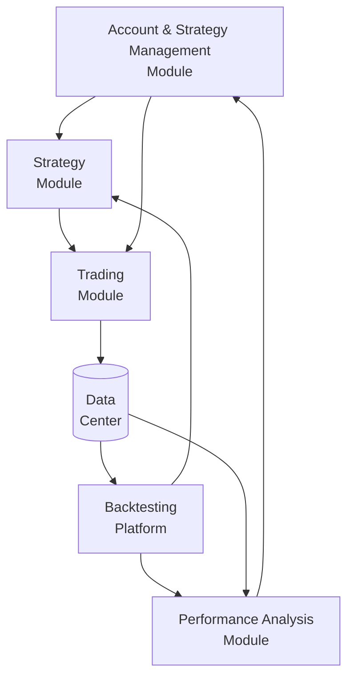

### Quant Investment System Architecture



- **Management Module**: Oversees the entire system, coordinating all other modules. It starts and stops strategies, adjusts their weights based on performance reports, manages risk and capital allocation, records positions and trades, and evaluates system operations.
- **Strategy Module**: Acts as a repository of various investment strategies, similar to having multiple portfolio managers with different styles. Strategies are developed and tested (backtesting phase) and then executed live. Strategies can be based on simple ideas (e.g., calendar effects), factor-driven (momentum, value, growth), classic trading strategies (pair trading, trend following), or advanced models (machine learning, deep learning).
- **Trading Module**: Executes trades as instructed by the management or strategy modules, interfacing with external trading APIs. It can split orders for optimal execution, record trades and positions, and operate in manual, semi-automated, or fully automated modes depending on strategy requirements and available trading interfaces.
- **Backtesting Platform**: Functions like an offline testing environment in machine learning, allowing strategies to be tested on historical data to optimize parameters and simulate performance.
- **Performance Analysis Module**: Evaluates the profitability and effectiveness of each strategy and system component, providing detailed reports. It calculates key metrics (annualized return, volatility, Sharpe ratio, max drawdown) and can attribute performance to specific factors or modules.
- **Data Center**: Stores all system data, including market data (prices, fundamentals), trading records, backtest results, and performance analytics. It typically consists of a core database for public data and an account database for all trading activities, supporting both real-time operations and post-trade analysis.

#### Implementation Sample (by module)

- Data Center: Provide clean, date-indexed price DataFrames for downstream use; normalize series where helpful; support both international data sources and China onshore.
  - Raw Data and Processed Data should be stored separately, if any error happens, developers can quickly spot
- Strategy Module: Last-N-day rotation logic with cash allowed; produce target weights per date aligned to trading calendar.
- Backtesting Platform: Combine multiple strategies with configurable weights; apply a one-day execution lag; compute account curve and core indicators.
  - the details of how weight are calculated can be stored (for example, in csv or in a ipynb notebook) so devlopers can quickly debugt
- Management Module: Pre-open, generate day-T target weights from T-1 data; size positions to available capital.
- Performance Analysis Module: Read realized holdings (e.g., account_holdings.csv), normalize to weights, and recompute realized account curve versus benchmarks.
  - data storage and analytics should be clean
  - GUI/dashboard development should be mainly focus on this module 
- Trading Module: Prefer exchange-traded ETFs for execution efficiency; integrate broker/exchange APIs when available; fall back to low-load mutual funds if needed.
- Data Center (international ETFs)

```python
import yfinance as yf
import pandas as pd

def load_prices(symbols, start, end):
    frames = {s: yf.download(s, start=start, end=end)['Close'] for s in symbols}
    df = pd.DataFrame(frames)
    return df / df.iloc[0]
```

- Data Center (China funds via Tushare)

```python
import tushare as ts
import pandas as pd

def load_cn_fund(ts_code, start, end, token):
    ts.set_token(token)
pro = ts.pro_api()
    df = pro.fund_daily(ts_code=ts_code, start_date=start, end_date=end)
    df['trade_date'] = pd.to_datetime(df['trade_date'])
    return df.sort_values('trade_date').set_index('trade_date')['close'].to_frame(ts_code)
```

- Strategy Module (rotation example, cash allowed)

```python
import pandas as pd

def rotation_stgy1(prices: pd.DataFrame, N: int) -> pd.DataFrame:
    # N-day return up to T-1
    nday = prices.shift(1) / prices.shift(N + 1) - 1
    weights = pd.DataFrame(0, index=prices.index, columns=prices.columns)
    for i in range(1, len(weights)):
        t = weights.index[i]
        t0 = weights.index[i - 1]
        if nday.loc[t0, 'hs300'] >= nday.loc[t0, 'csi500'] and nday.loc[t0, 'hs300'] > 0:
            weights.loc[t, 'hs300'] = 1
        elif nday.loc[t0, 'csi500'] > nday.loc[t0, 'hs300'] and nday.loc[t0, 'csi500'] > 0:
            weights.loc[t, 'csi500'] = 1
    return weights
```

- Backtesting Platform (combine strategies, 1-day execution lag)

```python
def backtest_account_curve(prices, weights):
    asset_ret = prices.pct_change()
    return (1 + (weights.shift(1) * asset_ret).sum(axis=1)).cumprod()
```

- Management Module (pre-open sizing)

```python
def target_values(weights_today, capital):
    return weights_today * capital
```

- Performance Analysis Module (from realized holdings)

```python
import pandas as pd

hold_mv = pd.read_csv('account_holdings.csv').set_index('date')
hold_wgt = hold_mv.iloc[:, 0:4].div(hold_mv['amount'], axis=0)
```

- Trading Module
  - Execution assumed for liquid index exposures. Integrate broker/exchange API when available; otherwise, trade exchange-traded ETFs (preferred fees) or low-load mutual fund share classes.

### Key Workflow

1. In the morning, check if the database has the latest data from all sources.
2. The strtegy management module creates daily strategy plans for each account, which the manager reviews before the market opens.
3. After the market opens, the strategy module sends trading decisions to the trading module, which executes trades throughout the day. Traders only intervene if needed.
4. During trading hours, machines or traders execute trades, researchers develop new strategies, and technical staff optimize system modules.
5. After market close, the trading module records all trades and positions, and the performance analysis module evaluates results and sends reports to managers.
6. If any issues are found, the manager organizes improvements.