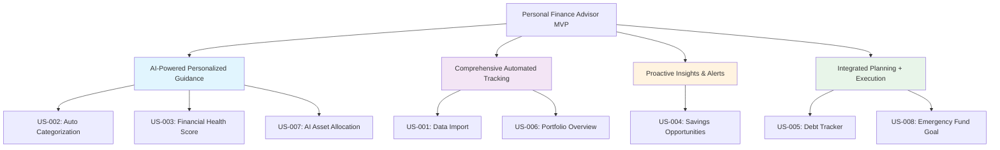

# User Stories: Personal Finance Advisor MVP

## User Story → Core Value Map

---

## Scope & Assumptions

- **Local-only usage**: Repository can be cloned and run without cloud dependencies
- **Manual data import**: Users import their own data (CSV/Parquet); no bank/Plaid integration required
- **Core value delivery**: Focus on AI guidance, automation, proactive insights, and integrated planning
- **Simplified debt handling**: Track balances and encourage saving/paydown; no complex debt strategies

---

## Core Value 1: AI-Powered Personalized Guidance

*"Expert financial advice accessible to everyone through intelligent AI recommendations"*

### US-002: Automatic Transaction Categorization
- **As a** user with imported transactions
- **I want to** have transactions auto-categorized using AI
- **So that** I reduce manual work and the AI learns my spending patterns

**Acceptance Criteria**:
- ✓ 20+ expense categories supported
- ✓ Bilingual support (Chinese/English)
- ✓ Learn from user corrections (simple rules memory)
- ✓ >80% baseline accuracy on common transactions

---

### US-003: Financial Health Snapshot
- **As a** user wanting to assess my financial situation
- **I want to** see an AI-generated health score and key improvement areas
- **So that** I know where to focus my efforts

**Acceptance Criteria**:
- ✓ Health score (0-100) with clear AI interpretation
- ✓ 3-5 key drivers (savings rate, emergency fund, debt ratio)
- ✓ Top 3 actionable AI recommendations
- ✓ Historical trend (3-month view)

**AI Capability**: Financial Diagnosis & Guidance
- Pattern recognition across spending, debts, and holdings
- Risk assessment with personalized recommendations
- Comprehensive diagnosis of strengths/risks with prioritized actions

---

### US-007: AI Asset Allocation Recommendation
- **As a** user wanting to invest appropriately
- **I want to** receive AI-generated target allocation recommendations
- **So that** I can optimize my portfolio with expert guidance

**Acceptance Criteria**:
- ✓ Risk-aligned target weights by asset class
- ✓ Clear rationale for each recommendation
- ✓ Example ETFs/tickers for implementation
- ✓ High-level rebalancing suggestions

**AI Capability**: Asset Allocation & Rationale
- Risk profiling based on user data
- Market analysis and instrument suggestions
- Rebalancing guidance with clear explanations

---

## Core Value 2: Comprehensive Automated Tracking

*"Eliminate manual tracking burden with seamless data consolidation"*

### US-001: Manual Data Import
- **As a** user
- **I want to** import transactions and holdings from local files
- **So that** I can analyze my financial data without manual entry

**Acceptance Criteria**:
- ✓ Load CSV/Parquet files with validation feedback
- ✓ Support standard formats (date, amount, description, category)
- ✓ Provide sample templates for data structure
- ✓ Handle common import errors gracefully

---

### US-006: Portfolio Overview
- **As a** user with investment holdings
- **I want to** see a consolidated view of my portfolio
- **So that** I understand my complete asset allocation and risk exposure

**Acceptance Criteria**:
- ✓ Aggregate asset allocation breakdown
- ✓ Performance vs simple benchmark (S&P 500)
- ✓ Basic fee and expense summary
- ✓ Risk level assessment

---

## Core Value 3: Proactive Insights & Alerts

*"Prevent financial mistakes before they happen with intelligent insights"*

### US-004: Savings Opportunities
- **As a** user wanting to save more
- **I want to** receive AI-identified opportunities to reduce spending
- **So that** I can increase my savings rate proactively

**Acceptance Criteria**:
- ✓ Identify recurring high-spend categories/merchants
- ✓ Estimate monthly savings potential
- ✓ Rank opportunities by ease of implementation
- ✓ Provide specific action steps

**AI Capability**: Savings Opportunity Finder
- Merchant analysis and subscription detection
- Spending pattern identification
- Top recurring waste/overages with estimated savings

---

## Core Value 4: Integrated Planning + Execution

*"Unified platform for setting goals and achieving financial milestones"*

### US-005: Debt Tracker & Reminders
- **As a** user with debts
- **I want to** track my debts and get reminders to save/pay more
- **So that** I stay motivated to reduce debt

**Acceptance Criteria**:
- ✓ List all debts (balance, APR, minimum payment)
- ✓ Track payoff progress over time
- ✓ Monthly reminder suggestions for extra payments
- ✓ Simple payoff timeline projection

---

### US-008: Emergency Fund Goal Setup
- **As a** user wanting financial resilience
- **I want to** set and track an emergency fund goal
- **So that** I can build a financial safety net

**Acceptance Criteria**:
- ✓ Set target amount (e.g., 3-6 months expenses)
- ✓ Calculate months to goal based on current savings
- ✓ Required monthly savings amount
- ✓ Visual progress tracking

**AI Capability**: Budget Baseline Generation
- Category-level monthly budget based on spending history
- 50/30/20 framework integration
- Goal-aligned adjustable recommendations

---

## Out of Scope for MVP

- Bank/Plaid integrations and OAuth authentication
- Complex UX edge cases, latency/performance SLAs
- Multi-user/household management
- Tax optimization and advanced scenario planning
- Voice interfaces and mobile-specific features
- Cryptocurrency tracking
- Real estate investment analysis

---

## First Sprint Focus (Core Value Priority)

### Sprint 1: Foundation + AI Guidance (Weeks 1-2)
1. **US-001**: Manual Data Import (foundation for all features)
2. **US-002**: Automatic Transaction Categorization (AI baseline)
3. **US-003**: Financial Health Snapshot (core AI value delivery)

### Sprint 2: Investment + Proactive Insights (Weeks 3-4)
4. **US-007**: AI Asset Allocation (investment guidance)
5. **US-004**: Savings Opportunities (proactive insights)

### Sprint 3: Integrated Planning (Weeks 5-6)
6. **US-006**: Portfolio Overview (tracking consolidation)
7. **US-005** or **US-008**: Debt Tracker OR Emergency Fund (planning + execution)

---

## Success Metrics

### Core Value Alignment
- **AI Guidance**: >70% user acceptance rate for AI recommendations
- **Automated Tracking**: 95% successful import rate for CSV formats
- **Proactive Insights**: Users act on >60% of savings opportunities
- **Integrated Planning**: >50% users complete at least one financial goal

### Technical Metrics
- **Categorization**: >80% accuracy on common transaction types
- **User Engagement**: Users complete health assessment within first session
- **Feature Adoption**: >60% users utilize at least 3 core features weekly

### User Outcomes (3-month targets)
- **Savings Increase**: $500+ average savings increase per user
- **Financial Confidence**: 40%+ improvement in self-reported confidence
- **Goal Achievement**: 30%+ users reach their first financial milestone
